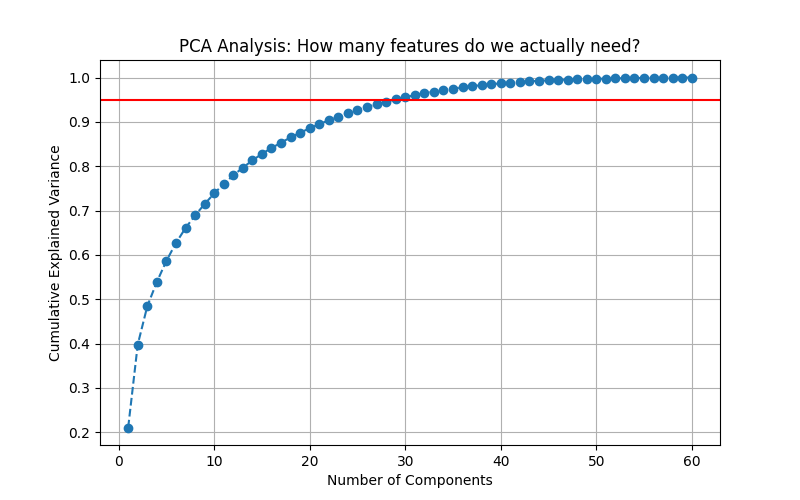

# Rock vs Mine Prediction

A machine learning project that classifies sonar signals as either rocks (R) or mines (M) using the UCI Sonar dataset. Two models are implemented and compared: a baseline Logistic Regression and an optimized SVM with PCA dimensionality reduction.

---

## Dataset
The dataset contains 208 samples, each with 60 sonar frequency readings as features and a label of either R (Rock) or M (Mine). Download it from [Kaggle](https://www.kaggle.com/datasets/mayurdalvi/sonar-mine-dataset) and place it in the `/data` folder as `sonar.csv`.

---

## Project Structure
```
Rock vs Mine/
├── data/
│   └── sonar.csv
├── code.py
├── svmpca.py
├── pca_scree_plot.png
└── README.md
```

---

## Requirements
```
pip install numpy pandas scikit-learn matplotlib
```

---

## Model 1 — Logistic Regression (`code.py`)

A simple baseline model to establish a performance benchmark.

**Approach:**
- 90/10 train/test split with stratification
- No feature scaling or dimensionality reduction
- Standard Logistic Regression classifier

**Results:**

| | Accuracy |
|---|---|
| Training | 83.42% |
| Test | 76.19% |

The relatively low test accuracy is expected — Logistic Regression assumes a linear decision boundary, but the sonar data is not linearly separable.

---

## Model 2 — SVM with PCA (`svmpca.py`)

A more sophisticated pipeline that addresses both the non-linearity of the data and its redundant features.

### Step 1 — PCA Analysis
Before training, PCA (Principal Component Analysis) was used to investigate how much of the 60 features are actually informative. The data was first scaled using `StandardScaler` since PCA is sensitive to feature scale.

The cumulative explained variance was plotted (see `pca_scree_plot.png`) and showed that **only 29 components are needed to retain 95% of the information** — meaning roughly half of the original 60 features are redundant.



### Step 2 — Dimensionality Reduction
PCA was applied to reduce the feature space from 60 to 29 components, removing noise while preserving 95% of the meaningful signal.

### Step 3 — Hyperparameter Tuning with GridSearchCV
Rather than guessing SVM parameters, GridSearchCV was used to train and evaluate 120 different model configurations using 5-fold cross-validation:

| Parameter | Values Tested | Meaning |
|---|---|---|
| C | 0.1, 1, 10, 100 | Strictness of the decision boundary |
| kernel | linear, rbf | Shape of the boundary |
| gamma | scale, auto, 0.1 | Reach of influence per data point |

Total models trained = 4(C) × 2(kernels) × 3(gamma) × 5(CV folds) = 120

**Best parameters found:** `C=10, kernel=rbf, gamma=scale`

The RBF kernel winning confirms the data is **non-linearly separable** — a straight boundary cannot cleanly distinguish rocks from mines. The RBF kernel creates curved boundaries that fit the data's true structure.

**Results:**

| | Accuracy |
|---|---|
| Training | 100.00% |
| Test | 95.24% |

The 100% training accuracy is expected with SVM using a strict `C=10` and RBF kernel — SVMs are designed to find the optimal separating boundary and will correctly classify all training points when given enough flexibility. The key metric is the test accuracy, and the small gap between train and test (≈5%) confirms the model is generalizing well and not overfitting.

---

## Comparison

| Model | Training Accuracy | Test Accuracy |
|---|---|---|
| Logistic Regression | 83.42% | 76.19% |
| SVM + PCA | 100.00% | 95.24% |

The SVM with PCA improved test accuracy by nearly **19 percentage points** over the baseline. The improvement comes from two factors: the RBF kernel capturing non-linear boundaries in the data, and PCA removing noisy redundant features before training.
